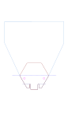

# Protogon Qwiic + EEPROM hexpansion

**The job in 60 seconds**

- **What:** review and finalise a small 2-layer KiCad [hexpansion](https://tildagon.badge.emfcamp.org/hexpansions/) — an add-on for the EMF [Tildagon](https://tildagon.badge.emfcamp.org/) badge that pairs a prototyping grid with an optional I²C identification EEPROM and a Qwiic/STEMMA QT connector. An LLM laid it out and no human PCB designer has ever checked it; you're being hired to be the first.
- **The core task is two bad placement calls the LLM made:** it bolted the Qwiic connector onto a clumsy "ear" off the rim, and dumped the EEPROM + pull-ups + decoupling cap in the dead centre of the proto grid, eating holes and silk. Place that block (`U1` EEPROM, `R1`/`R2` pull-ups, `C1` cap, `J3` Qwiic) *properly* — grouped and out of the way so a bare board is a full, clean grid again — route the I²C bus in real copper, and finalise the layout. Everything else flows from that.
- **Start from the base board, not this folder.** The board in *this* folder is the bad LLM attempt — reference only, **do not work from it**. Work from [`../codemyriad-protogon.kicad_pcb`](../codemyriad-protogon.kicad_pcb), the base board I trust (proven outline, edge connector, proto grid, breakout header; no SMD parts), and add the I²C block to it.
- **You need** KiCad fluency, real DFM judgement, and experience with card-edge / gold-finger connectors. **You don't need an EMF badge** — you validate fit on a printed 1:1 template; I do the final on-badge check.
- **Effort:** small and well-scoped — a few focused days, but correct me if that's off. I want someone who'll push back where I'm wrong as much as someone who lays out copper.
- **Hand back** one order-ready design that builds bare or fully populated — gerbers, drill, STEP, BOM, placement, DRC, fab spec (full list below).
- **How to bid:** price the full order-ready package, give a rough timeline, and flag anything in Scope you'd treat as separate. Budget/engagement details are on the Upwork post.

If you don't know Tildagon hexpansions, the load-bearing facts (pinout, mechanical limits, I²C/EEPROM mechanism, fab gotchas) are collected in [BACKGROUND.md](BACKGROUND.md), with primary sources linked at the bottom. The two short references that matter most:

- [Create a hexpansion](https://tildagon.badge.emfcamp.org/hexpansions/creating-hexpansions/) — official pinout, 1 mm / ENIG / 32 mm flats, per-slot I²C, no on-board pull-ups, 0x77 reserved
- [emfcamp/badge-2024-hardware `hexpansion/`](https://github.com/emfcamp/badge-2024-hardware/tree/main/hexpansion) — the official KiCad template + edge-connector footprint this board was derived from; mechanical source of truth

## Hard constraints — don't trade these away

- **1.0 mm FR4, ENIG finish.** The board edge is the connector (gold card-edge fingers). 1.6 mm or HASL won't seat/contact.
- **Black soldermask, white silk.** Aesthetic choice — some boards go out bare, so a bare board should look finished.
- **The SMD block is optional.** `U1` (CAT24C512 EEPROM), `R1`/`R2` (I²C pull-ups), `C1` (decoupling), `J3` (Qwiic) are the only SMD parts and must be one cleanly-grouped, omittable block. A bare board (none fitted) must be a complete, usable, good-looking protoboard. Pull-ups belong with the EEPROM, not on the base board.
- **The Code Myriad logo stays** (it's fine if hidden once seated).
- **Seats on a 2024 badge** — the geometry must let the tab seat, the ear clear a neighbour, and the cable exit outward.

| Item | Value |
|---|---|
| Layers | 2 |
| Thickness | 1.0 mm (required by the hexpansion standard) |
| Material | FR4 |
| Copper | 1 oz |
| Finish | ENIG (required: edge fingers are the contact surface) |
| Soldermask | black |
| Silkscreen | white |
| Edge bevel | none (not a considered choice — your call) |
| Profile | route as drawn: the left connector "mouth" slot **and** the right "ear" are intentional; the fab must not close or "fix" them |
| Size | ~56 × 37 mm (hex body ~48 × 37 mm + edge tongue + ~6 mm ear) |

## State of the two boards

Which board is which is in the 60-second block above; the caveats that aren't:

- **This folder's board** (`codemyriad-protogon-qwiic.kicad_pcb`) is the LLM attempt — reference only. Its schematic is stale (still carries the upstream template's LED/jumper/third resistor, missing the I²C parts), so a schematic-generated BOM is wrong — trust [the BOM CSV](codemyriad-protogon-qwiic-bom.csv) over it.
- DRC on it is "clean" only because `.kicad_pro` has most minimums zeroed; under a realistic fab profile it isn't. Re-run against your fab's real capability.
- **Neither board has been test-fitted on real hardware** — whether the +6 mm ear clears a populated neighbour is unverified (that's the on-badge check I run on your output).
- The EEPROM/firmware premise *is* verified against `badge-2024-software`: a CAT24C512 at `0x50` gets full 16-bit addressing and works through the identify/install path. See [DERISK-FINDINGS.md](DERISK-FINDINGS.md).

The detailed (AI-written) review with coordinates and suggested fixes is in [REVIEW-HANDOFF.md](REVIEW-HANDOFF.md). Treat its suggestions as one non-expert opinion, not instructions.

## Scope

**Must-have**

- [ ] Add the I²C block (`U1`, `R1`/`R2`, `C1`, `J3`) to the base board with clean placement: a grouped, omittable block that keeps the bare board a full, clean grid. Ear and connector out of the way. Placement is your call.
- [ ] Route the I²C + power bus genuinely in copper to every pad; pass DRC under JLCPCB's real capability profile (I plan to order there — not the zeroed rules). Watch vias landing in proto holes.
- [ ] Reconcile schematic and PCB — either ERC-clean, or formally make the PCB the source of truth and hand-maintain the parts list. Record the decision.
- [ ] Confirm fit on the 1:1 paper template (see fit check below). Watch height: the interior has a ~7 mm height-restricted zone — a vertical Qwiic socket (~8 mm) wouldn't clear it, which is why `J3` is a side-entry part on the ear with the cable exiting outward.
- [ ] Build for hand assembly — I order bare boards and hand-solder the parts (no machine assembly), so hand-solderable land patterns matter. Flag anything genuinely hard to hand-solder (the `J3` JST-SH connector is the prime suspect) and suggest a friendlier option if you have one.

**How I order:** bare boards from [JLCPCB](https://jlcpcb.com/) (1 mm FR4, ENIG) and parts from LCSC/Mouser, hand-soldered — no machine assembly. **Bonus points if you help me place the order:** JLCPCB-ready gerbers + the exact board options to pick, and a parts cart I can check out.

**Your judgement — I have none here**

- [ ] Pull-ups are 10 k (an LLM typed it). Size them for the real bus capacitance at 400 kHz, or tell me 10 k is right and why.
- [ ] `WP` is tied to GND (always writable, which the badge needs to provision). A solder-jumper to protect the ID block afterwards is cheap if you think it's worth it.
- [ ] Profile, ear, silk, mounting holes, panelisation + self-depanel for the odd outline, edge-finger lead-in, revision marker — anything that makes a clean bare board and an easy hand-build.

If you think the approach itself is wrong (no ear, no on-board EEPROM, four layers, …), say so. That's the point of hiring you.

## Deliverables

Order-ready package, one design giving both a bare and a populated build:

- updated KiCad project (PCB, schematic, project file), built from the base board with the I²C block added
- gerbers (explicit layer list, not saved plot params), drill + map, STEP
- a short JLCPCB fab/order spec (board options + the profile routed exactly as drawn — mouth + ear intentional)
- BOM + a hand-build placement guide for the populated variant with real MPNs (the [current BOM](codemyriad-protogon-qwiic-bom.csv) is a starting point — trust it over a schematic-generated one), plus the bare (omitted) variant
- fresh DRC report under the real ruleset, and an ERC-clean schematic (or a note that the PCB is source of truth)
- the 1:1 paper fit-check result (pass/fail + a photo of the board print registered on the template); I handle the physical on-badge check

Done:

- [ ] DRC clean (0 errors, 0 unconnected) under the fab's real rules; copper continuity actually checked, not just the ratsnest
- [ ] bus reaches every pad; EEPROM `0x50` + WP-GND real in copper
- [ ] fit validated on the 1:1 paper template; geometry supports tab-seat, neighbour clearance and outward cable exit (final on-badge check is mine)
- [ ] schematic ↔ PCB reconciled, decision recorded
- [ ] fresh fab outputs, timestamped after the final board save, in both variants

## Fit check

The on-screen envelope check is inconclusive, so the paper template is the test. Print [`../official-hexpansion-paper-template.svg`](../official-hexpansion-paper-template.svg) (or [the upstream original](https://raw.githubusercontent.com/emfcamp/badge-2024-hardware/main/hexpansion/hexpansion_paper_template.svg)) at **1:1**, register a 1:1 print of the board on the edge connector, and confirm:

1. the hex body sits within the maroon **"template"** outline → validates the base design;
2. the 6 mm ear stays within the light-blue **"hextended"** max envelope (the envelope that governs neighbour-slot clearance) → validates the qwiic delta.

Send me that result; I'll confirm the physical seat and neighbour clearance on a populated badge.

  
   Official 1:1 paper fit template — <a href="https://github.com/emfcamp/badge-2024-hardware/tree/main/hexpansion">emfcamp/badge-2024-hardware</a> (CERN-OHL-P-2.0). Print at 100%.

## Files in this folder

**Start file is in the parent folder:** [`../codemyriad-protogon.kicad_pcb`](../codemyriad-protogon.kicad_pcb) — the trusted base board you build on. Everything listed below is in *this* folder and is **reference only** (the LLM attempt + notes).

| File | Notes |
|---|---|
| `codemyriad-protogon-qwiic.kicad_pcb` | the LLM's attempt — **reference only, don't build on it**. Footprints embedded; opens and DRCs without the libs. |
| `codemyriad-protogon-qwiic.kicad_sch` | schematic — **stale**, don't trust a BOM from it. |
| `codemyriad-protogon-qwiic.kicad_pro` | project + design rules. Minimums mostly zeroed; replace with the fab's profile. |
| `codemyriad-protogon-qwiic-bom.csv` | hand-authored parts list with MPN + LCSC. Trust this over any schematic-generated BOM. (Trap noted: an earlier "ZD24C64A-XGMT" alternate is TSSOP, not SOIC — don't order it.) |
| `codemyriad-protogon-qwiic-preview.png`, `-routing.png` | top render + copper x-ray. |
| `BACKGROUND.md` | Tildagon primer + primary sources. Read if hexpansions are new to you. |
| `REVIEW-HANDOFF.md`, `DERISK-FINDINGS.md` | detailed (AI-written) review + de-risking notes. Depth, with caveats. |

Footprint libraries (`*.pretty`) live at the repo root — harmless lib warnings; footprints are embedded. The base board's fab package is in [`../fabrication/`](../fabrication/) (gerbers + drill only, no assembly files) — a reasonable folder-structure template to hand back.
