# Tildagon badge demos

Fifteen tiny, high-effect demos for the EMF Tildagon badge's round 240×240
screen — vector primitives, coarse grids and small particle systems rather than
brute-force per-pixel effects, which is what the badge's MicroPython
`update(delta)` / `draw(ctx)` model actually rewards. They come straight off the
shortlist in the design brief.

Each demo is a **standalone, unmodified badge app** (`demos/<name>/app.py`, a
`class … (app.App)` with `__app_export__`), named for what it shows:
`tixy`, `moire`, `qix`, `starfield`, `tunnel`, `kaleidoscope`, `hopalong`,
`matrixrain`, `plasma`, `ledring`, `pipes`, `cellular`, `ribbons`,
`metaballs`, `timescope`. Where a demo builds on someone's work, its header
says so ("Credits:" / "See also:") — most of these effects have decades of
history.

## The demos

Previews are host-simulator renders (logic + composition — not real badge
colour/timing). Every demo exits with **CANCEL**; ⬤ = also drives the ring LEDs.

<table>
<tr>
<td align="center">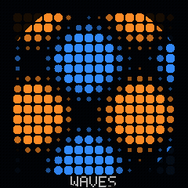<br><b>1 · <code>tixy</code></b> — Tixy grid<br><sub>one formula → 16×16 dot field</sub><br><sub>LEFT/RIGHT formula · UP/DOWN speed</sub><br><sub>after <a href="https://tixy.land">tixy.land</a></sub></td>
<td align="center">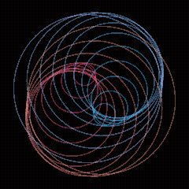<br><b>2 · <code>moire</code></b> — Moiré rings<br><sub>two drifting ring families interfere</sub><br><sub>RIGHT circles↔hexagons</sub><br><sub>after <a href="https://en.wikipedia.org/wiki/Moir%C3%A9_pattern">moiré pattern</a></sub></td>
<td align="center">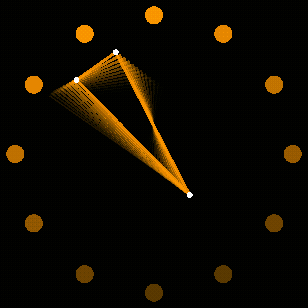<br><b>3 · <code>qix</code></b> — Qix tracer ⬤<br><sub>bouncing points, fading trail</sub><br><sub>CONFIRM add point · RIGHT palette</sub><br><sub>after <a href="https://en.wikipedia.org/wiki/Qix">Qix (1981)</a></sub></td>
</tr>
<tr>
<td align="center">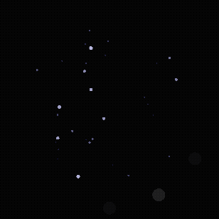<br><b>4 · <code>starfield</code></b> — IMU starfield ⬤<br><sub>tilt steers the drift</sub><br><sub>tilt (WASD in sim) · UP/DOWN warp</sub><br><sub>after <a href="https://en.wikipedia.org/wiki/Demo_effect">demo effect</a></sub></td>
<td align="center">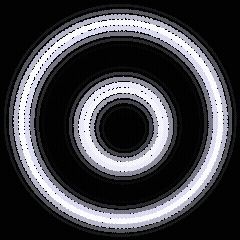<br><b>5 · <code>tunnel</code></b> — Polar tunnel<br><sub>concentric rings breathe</sub><br><sub>RIGHT colour scheme</sub><br><sub>after <a href="https://en.wikipedia.org/wiki/Demo_effect">demo effect</a></sub></td>
<td align="center">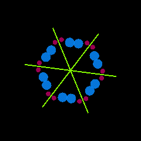<br><b>6 · <code>kaleidoscope</code></b> — Hex kaleidoscope<br><sub>one wedge stamped N-fold</sub><br><sub>CONFIRM randomise · RIGHT/LEFT symmetry</sub><br><sub>after <a href="https://en.wikipedia.org/wiki/Kaleidoscope">kaleidoscope</a></sub></td>
</tr>
<tr>
<td align="center">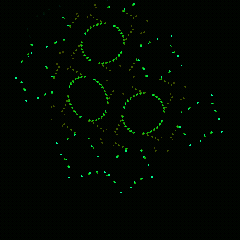<br><b>7 · <code>hopalong</code></b> — Hopalong<br><sub>strange-attractor cloud</sub><br><sub>RIGHT/LEFT preset</sub><br><sub>after <a href="https://en.wikibooks.org/wiki/Fractals/Hopalong">Hopalong attractor</a></sub></td>
<td align="center">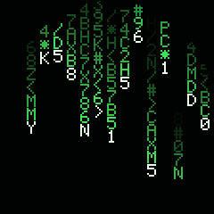<br><b>8 · <code>matrixrain</code></b> — Matrix rain<br><sub>glyph columns, round-cropped</sub><br><sub>RIGHT colour</sub><br><sub>after <a href="https://en.wikipedia.org/wiki/Matrix_digital_rain">digital rain</a></sub></td>
<td align="center">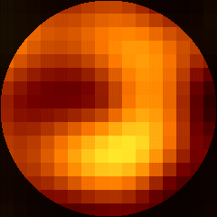<br><b>9 · <code>plasma</code></b> — Plasma tiles<br><sub>16×16 sum-of-sines plasma</sub><br><sub>RIGHT palette</sub><br><sub>after <a href="https://en.wikipedia.org/wiki/Plasma_effect">plasma effect</a></sub></td>
</tr>
<tr>
<td align="center">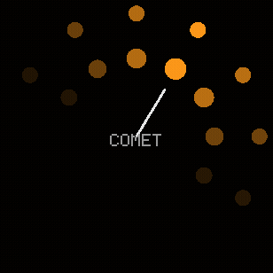<br><b>10 · <code>ledring</code></b> — LED phase-lock ⬤<br><sub>screen + ring LEDs share one phase</sub><br><sub>RIGHT comet/pulse/rainbow</sub></td>
<td align="center">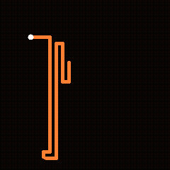<br><b>11 · <code>pipes</code></b> — Pipes grower<br><sub>orthogonal pipe runs on a grid</sub><br><sub>CONFIRM clear</sub><br><sub>after <a href="https://devblogs.microsoft.com/oldnewthing/20240611-00/?p=109881">3D Pipes</a></sub></td>
<td align="center">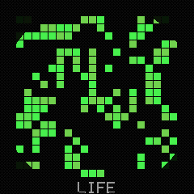<br><b>12 · <code>cellular</code></b> — Cellular<br><sub>Life / Brian's Brain / cyclic</sub><br><sub>CONFIRM reseed · RIGHT rule</sub><br><sub>after <a href="https://en.wikipedia.org/wiki/Conway%27s_Game_of_Life">Game of Life</a></sub></td>
</tr>
<tr>
<td align="center">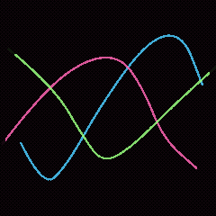<br><b>13 · <code>ribbons</code></b> — Drift lines<br><sub>braided spline ribbons</sub><br><sub>RIGHT/LEFT ribbon count</sub></td>
<td align="center">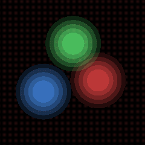<br><b>14 · <code>metaballs</code></b> — Metaballs (lite)<br><sub>orbiting translucent blobs</sub><br><sub>RIGHT/LEFT blob count</sub><br><sub>after <a href="https://en.wikipedia.org/wiki/Metaballs">metaballs</a></sub></td>
<td align="center">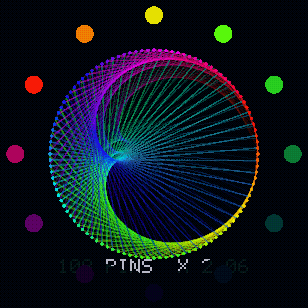<br><b>15 · <code>timescope</code></b> — Timescope ⬤<br><sub>times-table chords fold into cardioids</sub><br><sub>LEFT/RIGHT table · UP/DOWN speed · CONFIRM pins</sub><br><sub>after <a href="https://en.wikipedia.org/wiki/Cardioid#Cardioid_as_envelope_of_a_pencil_of_lines">multiplication circles</a></sub></td>
</tr>
</table>

## Run them — host simulator (no badge, no dependencies)

`demos/sim/` is a pure-standard-library host simulator: it fakes the badge
runtime (`app`, `events`, `system`, `imu`, `tildagonos`, and a software `ctx`
rasteriser), drives `update()`/`draw()`, and writes PPM frames. It needs only
Python 3; `ffmpeg` (optional) turns the frames into a GIF.

```bash
python3 demos/sim/run.py --list           # list the demo names
python3 demos/sim/run.py tixy --gif        # render tixy -> demos/tixy/tixy.gif
python3 demos/sim/run.py starfield --gif --frames 60
python3 demos/sim/run.py all --gif        # re-render every demo
```

Useful flags: `--frames N`, `--every N` (updates between captured frames),
`--warmup N` (updates before capture — bump it for `hopalong`/`pipes`/`cellular`),
`--step-ms`, `--fps`, `--press "30:RIGHT,60:CONFIRM"` (script inputs),
`--no-round` (skip the round-screen mask). The LED ring is drawn around the
screen whenever a demo lights it.

This validates **logic and composition only** — real colours, frame rate and
the on-glass round crop still need the badge or the official simulator.

## Run them in the badge emulator (official SDL2 simulator, real ctx)

This is the badge emulator from `emfcamp/badge-2024-software`: a desktop window
running the real firmware + real uctx. Copy paste, from this repo's root:

```bash
# 1. get the emulator (once)
git clone --recursive https://github.com/emfcamp/badge-2024-software.git

# 2. install these demos into it (writes sim/apps/<Name>/ for each demo)
python3 demos/sim/install_to_official_sim.py badge-2024-software

# 3. launch the emulator
cd badge-2024-software/sim
cp config.py.default config.py            # buttons -> number keys, WASD = tilt
pipenv install                            # needs Python 3.10 + SDL2 (see below)
pipenv run python run.py                  # opens the launcher; pick a "Demos" entry
```

To skip the launcher and boot straight into one demo, pass `<Folder>.<Class>`
(both are the Capitalised name), e.g. `pipenv run python run.py Tixy.Tixy` or
`pipenv run python run.py Starfield.Starfield`.

**Controls in the emulator** (with `config.py` copied): `1`=UP `2`=RIGHT
`3`=CONFIRM `8`=DOWN `9`=LEFT `0`=CANCEL — or click the on-screen button dots.
**W/A/S/D** tilt the accelerometer (steers the `starfield` starfield). The ring LEDs
render around the screen (used by `qix`, `starfield`, `ledring`).

**Prereqs:** the sim pins **Python 3.10** (not newer) and needs **pipenv** and
**SDL2** (`pip install --user pipenv`; on Linux the pygame wheel usually bundles
SDL2, else `sudo apt install libsdl2-2.0-0 libsdl2-image-2.0-0
libsdl2-mixer-2.0-0 libsdl2-ttf-2.0-0`). `install_to_official_sim.py` handles
the app wiring: it writes each demo into `sim/apps/<Name>/` with the
`metadata.json` + `__init__.py` the launcher expects, Capitalising folder/class
names so the `starfield` demo becomes an importable `For` (a bare `starfield` package can't
be imported).

Re-run step 2 any time you edit a demo to re-sync it into the emulator.

## Run them — on a real badge

Each `app.py` is a normal badge app. Drop a folder into your badge over
`mpremote` (with a `tildagon.toml`/`metadata.json`), publish through the app
store, or ship one on a hexpansion EEPROM (that's Protogon's day job — see the
sibling `app/` and `eeprom-image/` branches). The demos only use documented
APIs and clean up after themselves (the LED demos hand the ring back to the
system pattern service on exit).

## Porting notes (verified against emfcamp/badge-2024-software)

These are the facts the demos were written against — handy if you fork one:

- **Screen** is 240×240, **origin at the centre** (coords −120..+120), angles in
  radians. Clear each frame with `ctx.rgb(0,0,0).rectangle(-120,-120,240,240).fill()`.
- **`update(delta)`**: `delta` is **milliseconds**. Returning **`False` skips
  the redraw**; return `True`/`None` to draw. An app starts backgrounded — emit
  `RequestForegroundPushEvent(self)` once (guarded by a flag) to take the screen.
- **`ctx`** is uctx (a subset in the sim). Chainable draw/colour/transform calls
  return `self`; **properties** (`line_width`, `font_size`, `text_align`,
  `global_alpha`) are *assigned*, never read back. Pass colours as **0.0–1.0
  floats** (real uctx does not clamp). There is **no `rect` alias** — use
  `rectangle`. `scale(x, y)` needs both args.
- **LEDs** are 1-indexed `tildagonos.leds[1..12] = (r,g,b)` (0–255) then
  `.write()`. A system service owns the ring, so emit **`PatternDisable()`**
  before driving it and **`PatternEnable()`** when you leave (the `qix`/`starfield`/
  `ledring` demos do exactly this).
- **IMU**: `import imu; imu.acc_read()` → `(x,y,z)` m/s² (dummy in the sim,
  WASD-driven). Wrap reads in `try/except (AttributeError, OSError, Exception)`
  and fall back — some IMU functions exist only on hardware, others only in the
  sim (`starfield` shows the pattern).

### Conventions the web playground rewards

The [live playground](web/) adds a couple of zero-cost affordances if you
write the demo a certain way. They are all plain Python — a badge or the
official sim ignores them:

- **Tweak numbers / swatch**: any plain int/float literal is drag-to-change
  (double-click, or tap on a touchscreen, for a slider), and any three
  `0.0–1.0` literals that form an `(r, g, b)` tuple or `ctx.rgb(...)` arguments
  get a tap-to-open colour picker (those numbers stay with the picker — no
  slider). So hoist the fun knobs into the `# --- tweak me ---` block as bare
  literals and express colours as `(r, g, b)` constants, not computed/HSV
  expressions.
- **Slider ranges** (`# MIN<n<MAX`): a note like `GRID = 16  # 4<n<24` sets
  that number's slider bounds. One number per line uses `n`; with several on a
  line, letters map left-to-right (`C = (2.2, 3.3)  # 1<a<5 3<b<10`). The
  bounds live in the comment, so a badge ignores them. `tixy` and `tunnel`
  annotate their whole tweak block this way.
- **Pick-one groups** (`#: label`): a run of adjacent same-indent lines each
  ending in a `#: name` marker becomes a clickable radio group — exactly the
  uncommented one runs, the rest are commented out, and clicking swaps live.
  Great for "choose a formula / palette / rule". `tixy` and `tunnel` show it:
  ```python
  LIVE = waves      #: waves
  # LIVE = spin     #: spin
  # LIVE = ripple   #: ripple
  ```
- **`__live_state__`**: on an edit the playground carries scalar state
  (`t`, `speed`, …) into the new instance so the animation never restarts. Set
  `__live_state__ = ("t",)` on the class to list exactly what to carry — leave
  the picked value *out* so clicking a new choice takes effect immediately
  (both `tixy` and `tunnel` do this).

## Layout

```
demos/
  sim/
    tildagon_sim.py            fake badge runtime + software ctx rasteriser
    run.py                     CLI: render a demo (or all) to frames/GIF
    install_to_official_sim.py drop the demos into the SDL2 simulator
  <name>/app.py                one standalone badge app per demo
  <name>/<name>.gif            a host-sim render of it
```
